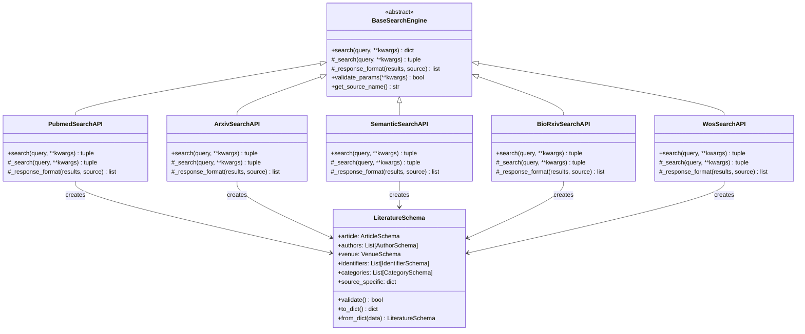
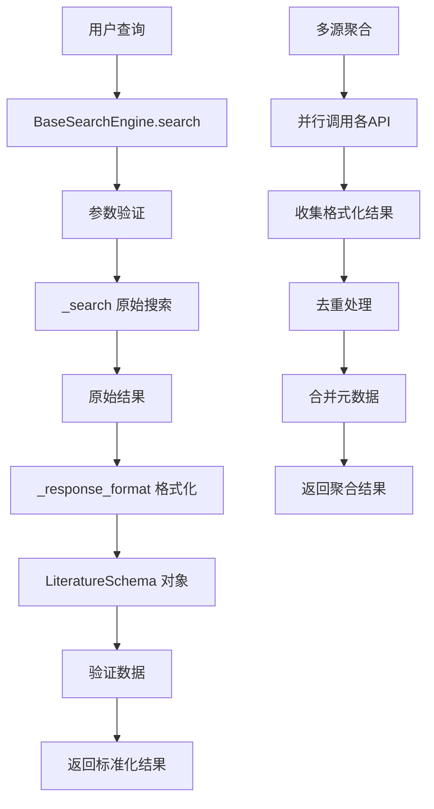

# 设计文档

## 概述

本设计文档描述了搜索API重构的详细架构，包括搜索引擎基类的设计、文献schema类的定义，以及如何将现有的搜索API重构为统一的架构。重构的目标是提供一个可扩展、标准化且向后兼容的搜索框架。

## 架构

### 整体架构图



## 组件和接口

### 1. 搜索引擎基类 (BaseSearchEngine)

#### 设计原则
- 提供统一的搜索接口规范
- 强制实现核心方法
- 支持参数验证和错误处理
- 保持向后兼容性

#### 核心接口

```python
from abc import ABC, abstractmethod
from typing import Dict, List, Tuple, Any, Optional

class BaseSearchEngine(ABC):
    """搜索引擎基类 - 定义统一的搜索接口"""
    
    def __init__(self):
        self.source_name = self.get_source_name()
        self.max_results_limit = 10000
        self.default_results = 50
    
    def search(self, query: str, **kwargs) -> Tuple[List[Dict], Dict]:
        """
        公共搜索接口 - 所有搜索API的统一入口点
        
        Args:
            query: 搜索查询字符串
            **kwargs: 搜索参数（年份、字段、排序等）
            
        Returns:
            Tuple[formatted_results, metadata]
        """
        # 1. 参数验证
        if not self.validate_params(query, **kwargs):
            return [], {'error': 'Invalid parameters'}
        
        # 2. 执行原始搜索
        raw_results, metadata = self._search(query, **kwargs)
        
        # 3. 格式化结果
        formatted_results = self._response_format(raw_results, self.source_name)
        
        # 4. 更新元数据
        metadata.update({
            'source': self.source_name,
            'formatted_count': len(formatted_results),
            'raw_count': len(raw_results)
        })
        
        return formatted_results, metadata
    
    @abstractmethod
    def _search(self, query: str, **kwargs) -> Tuple[List[Dict], Dict]:
        """
        原始搜索方法 - 子类必须实现
        
        Args:
            query: 搜索查询字符串
            **kwargs: 搜索参数
            
        Returns:
            Tuple[raw_results, metadata]
        """
        pass
    
    @abstractmethod
    def _response_format(self, results: List[Dict], source: str) -> List[Dict]:
        """
        响应格式化方法 - 子类必须实现
        
        Args:
            results: 原始搜索结果
            source: 数据源名称
            
        Returns:
            List[formatted_results] - 符合LiteratureSchema的结果列表
        """
        pass
    
    @abstractmethod
    def get_source_name(self) -> str:
        """获取数据源名称"""
        pass
    
    def validate_params(self, query: str, **kwargs) -> bool:
        """
        参数验证 - 可被子类重写以添加特定验证
        
        Args:
            query: 搜索查询
            **kwargs: 搜索参数
            
        Returns:
            bool: 参数是否有效
        """
        if not query or not query.strip():
            return False
        
        num_results = kwargs.get('num_results', self.default_results)
        if not isinstance(num_results, int) or num_results <= 0 or num_results > self.max_results_limit:
            return False
        
        return True
```

### 2. 文献Schema类 (LiteratureSchema)

#### 设计原则
- 基于database_design.md的数据库结构
- 支持数据验证和类型检查
- 提供灵活的序列化/反序列化
- 支持部分字段缺失的情况

#### Schema定义

```python
from dataclasses import dataclass, field
from typing import List, Optional, Dict, Any, Union
from datetime import datetime, date
from enum import Enum

class IdentifierType(Enum):
    DOI = "doi"
    PMID = "pmid"
    ARXIV_ID = "arxiv_id"
    SEMANTIC_SCHOLAR_ID = "semantic_scholar_id"
    WOS_UID = "wos_uid"
    PII = "pii"
    PMC_ID = "pmc_id"
    CORPUS_ID = "corpus_id"

class VenueType(Enum):
    JOURNAL = "journal"
    CONFERENCE = "conference"
    PREPRINT_SERVER = "preprint_server"
    BOOK = "book"
    OTHER = "other"

@dataclass
class ArticleSchema:
    """文章基本信息Schema"""
    primary_doi: Optional[str] = None
    title: str = ""
    abstract: Optional[str] = None
    language: str = "eng"
    publication_year: Optional[int] = None
    publication_date: Optional[Union[str, date]] = None
    updated_date: Optional[Union[str, date]] = None
    citation_count: int = 0
    reference_count: int = 0
    influential_citation_count: int = 0
    is_open_access: bool = False
    open_access_url: Optional[str] = None

@dataclass
class AuthorSchema:
    """作者信息Schema"""
    full_name: str = ""
    last_name: Optional[str] = None
    fore_name: Optional[str] = None
    initials: Optional[str] = None
    orcid: Optional[str] = None
    semantic_scholar_id: Optional[str] = None
    affiliation: Optional[str] = None
    is_corresponding: bool = False
    author_order: Optional[int] = None

@dataclass
class VenueSchema:
    """发表场所Schema"""
    venue_name: str = ""
    venue_type: VenueType = VenueType.OTHER
    iso_abbreviation: Optional[str] = None
    issn_print: Optional[str] = None
    issn_electronic: Optional[str] = None
    publisher: Optional[str] = None
    country: Optional[str] = None

@dataclass
class PublicationSchema:
    """发表信息Schema"""
    volume: Optional[str] = None
    issue: Optional[str] = None
    start_page: Optional[str] = None
    end_page: Optional[str] = None
    page_range: Optional[str] = None
    article_number: Optional[str] = None

@dataclass
class IdentifierSchema:
    """标识符Schema"""
    identifier_type: IdentifierType
    identifier_value: str
    is_primary: bool = False

@dataclass
class CategorySchema:
    """学科分类Schema"""
    category_name: str
    category_code: Optional[str] = None
    category_type: str = "other"  # mesh_descriptor, arxiv_category, field_of_study, etc.
    is_major_topic: bool = False
    confidence_score: Optional[float] = None

@dataclass
class PublicationTypeSchema:
    """发表类型Schema"""
    type_name: str
    type_code: Optional[str] = None
    source_type: str = "general"

@dataclass
class LiteratureSchema:
    """统一文献Schema - 基于database_design.md"""
    
    # 核心信息
    article: ArticleSchema = field(default_factory=ArticleSchema)
    authors: List[AuthorSchema] = field(default_factory=list)
    venue: VenueSchema = field(default_factory=VenueSchema)
    publication: PublicationSchema = field(default_factory=PublicationSchema)
    
    # 标识符和分类
    identifiers: List[IdentifierSchema] = field(default_factory=list)
    categories: List[CategorySchema] = field(default_factory=list)
    publication_types: List[PublicationTypeSchema] = field(default_factory=list)
    
    # 源数据信息
    source_specific: Dict[str, Any] = field(default_factory=dict)
    
    def validate(self) -> Tuple[bool, List[str]]:
        """验证数据完整性"""
        errors = []
        
        # 必需字段验证
        if not self.article.title.strip():
            errors.append("Article title is required")
        
        # DOI格式验证
        if self.article.primary_doi and not self._is_valid_doi(self.article.primary_doi):
            errors.append("Invalid DOI format")
        
        # 年份验证
        if self.article.publication_year:
            current_year = datetime.now().year
            if self.article.publication_year < 1000 or self.article.publication_year > current_year + 5:
                errors.append("Invalid publication year")
        
        # 作者信息验证
        for i, author in enumerate(self.authors):
            if not author.full_name.strip():
                errors.append(f"Author {i+1} name is required")
        
        return len(errors) == 0, errors
    
    def _is_valid_doi(self, doi: str) -> bool:
        """验证DOI格式"""
        import re
        doi_pattern = r'^10\.\d{4,}/[^\s]+$'
        return bool(re.match(doi_pattern, doi))
    
    def to_dict(self) -> Dict[str, Any]:
        """转换为字典格式"""
        from dataclasses import asdict
        return asdict(self)
    
    @classmethod
    def from_dict(cls, data: Dict[str, Any]) -> 'LiteratureSchema':
        """从字典创建实例"""
        # 处理嵌套对象
        if 'article' in data and isinstance(data['article'], dict):
            data['article'] = ArticleSchema(**data['article'])
        
        if 'venue' in data and isinstance(data['venue'], dict):
            data['venue'] = VenueSchema(**data['venue'])
        
        if 'publication' in data and isinstance(data['publication'], dict):
            data['publication'] = PublicationSchema(**data['publication'])
        
        # 处理列表对象
        if 'authors' in data:
            data['authors'] = [AuthorSchema(**author) if isinstance(author, dict) else author 
                              for author in data['authors']]
        
        if 'identifiers' in data:
            data['identifiers'] = [IdentifierSchema(**identifier) if isinstance(identifier, dict) else identifier 
                                  for identifier in data['identifiers']]
        
        return cls(**data)
    
    def get_primary_identifier(self, identifier_type: IdentifierType) -> Optional[str]:
        """获取指定类型的主要标识符"""
        for identifier in self.identifiers:
            if identifier.identifier_type == identifier_type and identifier.is_primary:
                return identifier.identifier_value
        return None
    
    def add_identifier(self, identifier_type: IdentifierType, value: str, is_primary: bool = False):
        """添加标识符"""
        if value and value.strip():
            self.identifiers.append(IdentifierSchema(
                identifier_type=identifier_type,
                identifier_value=value.strip(),
                is_primary=is_primary
            ))
```

### 3. 响应格式化器重构

#### 设计原则
- 统一格式化逻辑
- 支持字段映射配置
- 处理缺失数据
- 保持原始数据引用

```python
class EnhancedResponseFormatter:
    """增强的响应格式化器"""
    
    # 字段映射配置
    FIELD_MAPPINGS = {
        'pubmed': {
            'title': 'title',
            'abstract': 'abstract',
            'doi': 'doi',
            'pmid': 'pmid',
            'authors': 'authors',
            'journal': 'journal',
            'year': 'year',
            'published_date': 'published_date',
            'volume': 'volume',
            'issue': 'issue',
            'issn': 'issn',
            'eissn': 'eissn'
        },
        'arxiv': {
            'title': 'title',
            'abstract': 'abstract',
            'doi': 'doi',
            'arxiv_id': 'arxiv_id',
            'authors': 'authors',
            'journal': 'journal',
            'year': 'year',
            'published_date': 'published_date',
            'pdf_url': 'pdf_url'
        },
        'semantic_scholar': {
            'title': 'title',
            'abstract': 'abstract',
            'doi': 'doi',
            'pmid': 'pmid',
            'arxiv_id': 'arxiv_id',
            'paperId': 'semantic_scholar_id',
            'authors': 'authors',
            'journal': 'journal',
            'venue': 'venue',
            'year': 'year',
            'published_date': 'published_date',
            'citation_count': 'citation_count',
            'reference_count': 'references_count',
            'isOpenAccess': 'is_open_access',
            'openAccessPdf': 'open_access_url'
        }
    }
    
    @classmethod
    def format_to_schema(cls, item: Dict[str, Any], source: str) -> LiteratureSchema:
        """将原始数据格式化为LiteratureSchema"""
        
        mapping = cls.FIELD_MAPPINGS.get(source, {})
        
        # 创建文章信息
        article = ArticleSchema(
            primary_doi=cls._get_mapped_value(item, mapping, 'doi'),
            title=cls._get_mapped_value(item, mapping, 'title', ''),
            abstract=cls._get_mapped_value(item, mapping, 'abstract'),
            publication_year=cls._get_mapped_value(item, mapping, 'year'),
            publication_date=cls._get_mapped_value(item, mapping, 'published_date'),
            citation_count=cls._get_mapped_value(item, mapping, 'citation_count', 0),
            reference_count=cls._get_mapped_value(item, mapping, 'reference_count', 0),
            is_open_access=cls._get_mapped_value(item, mapping, 'is_open_access', False),
            open_access_url=cls._get_mapped_value(item, mapping, 'open_access_url')
        )
        
        # 创建作者信息
        authors = []
        raw_authors = cls._get_mapped_value(item, mapping, 'authors', [])
        for i, author_name in enumerate(raw_authors):
            if isinstance(author_name, str):
                authors.append(AuthorSchema(
                    full_name=author_name,
                    author_order=i + 1
                ))
        
        # 创建场所信息
        venue = VenueSchema(
            venue_name=cls._get_mapped_value(item, mapping, 'journal') or cls._get_mapped_value(item, mapping, 'venue', ''),
            venue_type=cls._determine_venue_type(source),
            issn_print=cls._get_mapped_value(item, mapping, 'issn'),
            issn_electronic=cls._get_mapped_value(item, mapping, 'eissn')
        )
        
        # 创建发表信息
        publication = PublicationSchema(
            volume=cls._get_mapped_value(item, mapping, 'volume'),
            issue=cls._get_mapped_value(item, mapping, 'issue')
        )
        
        # 创建标识符
        identifiers = []
        cls._add_identifier_if_exists(identifiers, item, mapping, 'doi', IdentifierType.DOI, True)
        cls._add_identifier_if_exists(identifiers, item, mapping, 'pmid', IdentifierType.PMID)
        cls._add_identifier_if_exists(identifiers, item, mapping, 'arxiv_id', IdentifierType.ARXIV_ID)
        cls._add_identifier_if_exists(identifiers, item, mapping, 'semantic_scholar_id', IdentifierType.SEMANTIC_SCHOLAR_ID)
        
        # 创建完整的文献Schema
        literature = LiteratureSchema(
            article=article,
            authors=authors,
            venue=venue,
            publication=publication,
            identifiers=identifiers,
            source_specific={
                'source': source,
                'raw_data': item
            }
        )
        
        return literature
    
    @staticmethod
    def _get_mapped_value(item: Dict, mapping: Dict, key: str, default=None):
        """获取映射后的值"""
        mapped_key = mapping.get(key, key)
        return item.get(mapped_key, default)
    
    @staticmethod
    def _determine_venue_type(source: str) -> VenueType:
        """根据数据源确定场所类型"""
        if source == 'arxiv':
            return VenueType.PREPRINT_SERVER
        elif source == 'biorxiv':
            return VenueType.PREPRINT_SERVER
        else:
            return VenueType.JOURNAL
    
    @staticmethod
    def _add_identifier_if_exists(identifiers: List, item: Dict, mapping: Dict, 
                                 key: str, identifier_type: IdentifierType, is_primary: bool = False):
        """如果标识符存在则添加"""
        value = EnhancedResponseFormatter._get_mapped_value(item, mapping, key)
        if value and str(value).strip():
            identifiers.append(IdentifierSchema(
                identifier_type=identifier_type,
                identifier_value=str(value).strip(),
                is_primary=is_primary
            ))
```

## 数据模型

### 数据流图



### 兼容性策略

为了保持向后兼容性，现有的API将：

1. **保持现有方法签名**：`search()` 方法的参数和返回值格式不变
2. **添加新的格式化选项**：通过参数控制是否返回新的schema格式
3. **渐进式迁移**：允许逐步迁移到新的架构

```python
# 兼容性包装器示例
class BackwardCompatiblePubmedAPI(PubmedSearchAPI):
    def search(self, query: str, return_schema: bool = False, **kwargs):
        """向后兼容的搜索方法"""
        if return_schema:
            # 返回新的LiteratureSchema格式
            return super().search(query, **kwargs)
        else:
            # 返回原有格式
            formatted_results, metadata = super().search(query, **kwargs)
            # 转换为原有格式
            legacy_results = [result['source_specific']['raw_data'] for result in formatted_results]
            return legacy_results, metadata
```

## 错误处理

### 错误处理策略

1. **参数验证错误**：在基类中统一处理，返回标准错误格式
2. **网络请求错误**：在子类中处理，支持重试机制
3. **数据格式化错误**：记录警告但不中断处理，返回部分数据
4. **Schema验证错误**：记录详细错误信息，支持调试

```python
class SearchError(Exception):
    """搜索相关错误基类"""
    pass

class ParameterValidationError(SearchError):
    """参数验证错误"""
    pass

class NetworkError(SearchError):
    """网络请求错误"""
    pass

class FormatError(SearchError):
    """数据格式化错误"""
    pass
```

## 测试策略

### 单元测试

1. **基类测试**：验证抽象方法强制实现、参数验证逻辑
2. **Schema测试**：验证数据验证、序列化/反序列化
3. **格式化器测试**：验证各数据源的字段映射正确性
4. **API测试**：验证每个搜索API的功能和兼容性

### 集成测试

1. **端到端测试**：验证完整的搜索流程
2. **多源聚合测试**：验证并行搜索和结果合并
3. **性能测试**：验证重构后的性能表现
4. **兼容性测试**：验证向后兼容性

这个设计提供了一个清晰、可扩展且向后兼容的搜索API重构方案，通过统一的基类和标准化的schema确保了代码的一致性和可维护性。